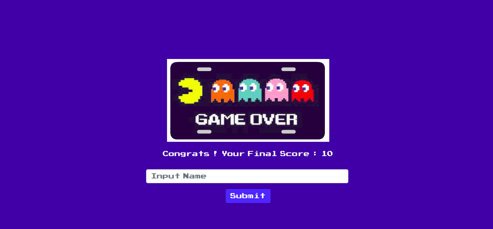
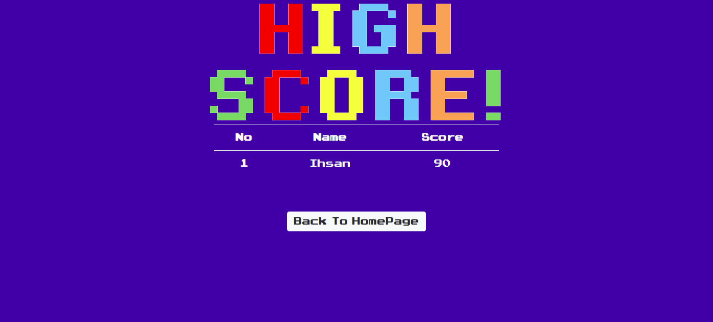
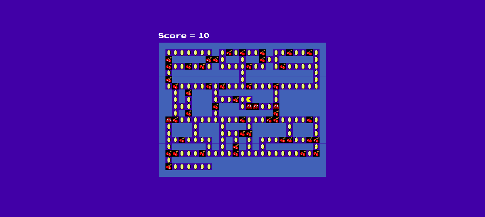
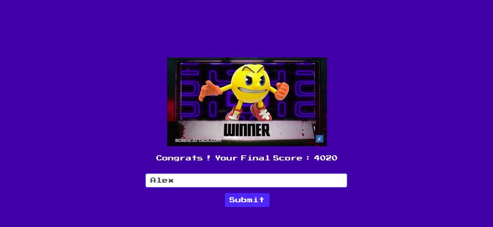

# PacMan-Arcade-Machine

## NAMA
Muhammad Hanif Adzkiya

## NIM 
13517120

## Nomor urutan lab IRK sebagai pilihan
1

## Panduan menginstal permainan
Permainan ini memakai jquery dan node js. Jquery diginakan untuk merender dan menjalankan permainan. Sedangkan node js untuk membaca score dari file score.json dan mengupdate file score.json 
1. npm install 
2. node server.js 
3. Run index.html in your browser

## Panduan memainkan permainan
Gunakan keyboard panah atas, bawah, kiri, dan kanan untuk menggerakkan pac man. Ambil sebanyak mungkin koin, hindari hantu, dan selamat bersenang - senang

## Alasan pemilihan algoritma 
Algoritma yang dipilih adalah BFS karena :  
1. Ukuran maze yang kecil sehingga algoritma BFS tidak terlalu makan banyak waktu yang signifikan 
2. Jika memakai dijkstra diperlukan array dengan indeks yang banyak dan susah dalam menentukan edgenya dikarenakan posisi hantu yang dinamis.  

## Screenshot program

 
 
 
 
 